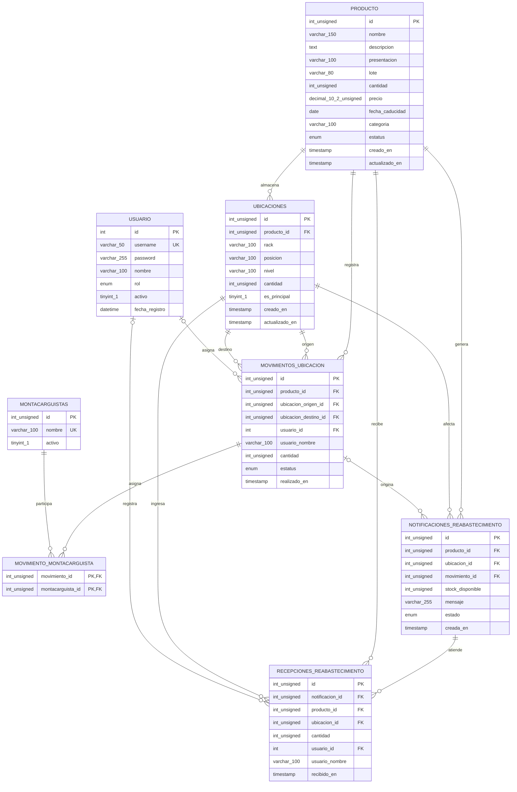

# Modelo Entidad-Relación

Esquema consultado desde la base MySQL `ynecrud` el 2026-09-26.

> En el diagrama, los tipos compuestos se escriben sin espacios para ajustarse a la sintaxis Mermaid. El diccionario siguiente muestra los tipos SQL exactos.

## Diccionario de datos

| Tabla | Columna | Tipo SQL | Clave / detalle |
|---|---|---|---|
| `producto` | `id` | `int(10) unsigned` | PK, autoincremental |
| `producto` | `nombre` | `varchar(150)` | NOT NULL, índice |
| `producto` | `descripcion` | `text` | NOT NULL |
| `producto` | `presentacion` | `varchar(100)` | NOT NULL |
| `producto` | `lote` | `varchar(80)` | NOT NULL |
| `producto` | `cantidad` | `int(10) unsigned` | NOT NULL |
| `producto` | `precio` | `decimal(10,2) unsigned` | NOT NULL |
| `producto` | `fecha_caducidad` | `date` | NOT NULL |
| `producto` | `categoria` | `varchar(100)` | NOT NULL, índice |
| `producto` | `estatus` | `enum('Activo','Rechazado','Cancelado','Sin existencia')` | NOT NULL, índice |
| `producto` | `creado_en` | `timestamp` | NOT NULL, default actual |
| `producto` | `actualizado_en` | `timestamp` | NOT NULL, se actualiza automáticamente |
| `ubicaciones` | `id` | `int(10) unsigned` | PK, autoincremental |
| `ubicaciones` | `producto_id` | `int(10) unsigned` | FK → `producto.id` |
| `ubicaciones` | `rack` | `varchar(100)` | NOT NULL |
| `ubicaciones` | `posicion` | `varchar(100)` | NOT NULL |
| `ubicaciones` | `nivel` | `varchar(100)` | NOT NULL |
| `ubicaciones` | `cantidad` | `int(10) unsigned` | NOT NULL |
| `ubicaciones` | `es_principal` | `tinyint(1)` | NOT NULL; 1 identifica AlmacenGeneral |
| `ubicaciones` | `creado_en` | `timestamp` | NOT NULL, default actual |
| `ubicaciones` | `actualizado_en` | `timestamp` | NOT NULL, se actualiza automáticamente |
| `usuario` | `id` | `int(11)` | PK, autoincremental |
| `usuario` | `username` | `varchar(50)` | NOT NULL, UNIQUE |
| `usuario` | `password` | `varchar(255)` | NOT NULL; almacena el hash |
| `usuario` | `nombre` | `varchar(100)` | NOT NULL |
| `usuario` | `rol` | `enum('ADMIN','MODERADOR','AYUDANTE')` | NOT NULL |
| `usuario` | `activo` | `tinyint(1)` | Puede ser NULL |
| `usuario` | `fecha_registro` | `datetime` | Puede ser NULL |
| `montacarguistas` | `id` | `int(10) unsigned` | PK, autoincremental |
| `montacarguistas` | `nombre` | `varchar(100)` | NOT NULL, UNIQUE |
| `montacarguistas` | `activo` | `tinyint(1)` | NOT NULL, default 1 |
| `movimientos_ubicacion` | `id` | `int(10) unsigned` | PK, autoincremental |
| `movimientos_ubicacion` | `producto_id` | `int(10) unsigned` | FK → `producto.id` |
| `movimientos_ubicacion` | `ubicacion_origen_id` | `int(10) unsigned` | FK → `ubicaciones.id` |
| `movimientos_ubicacion` | `ubicacion_destino_id` | `int(10) unsigned` | FK → `ubicaciones.id` |
| `movimientos_ubicacion` | `usuario_id` | `int(11)` | NULL; FK → `usuario.id` |
| `movimientos_ubicacion` | `usuario_nombre` | `varchar(100)` | NOT NULL, copia histórica del nombre |
| `movimientos_ubicacion` | `cantidad` | `int(10) unsigned` | NOT NULL |
| `movimientos_ubicacion` | `estatus` | `enum('Completado')` | NOT NULL |
| `movimientos_ubicacion` | `realizado_en` | `timestamp` | NOT NULL, índice |
| `movimiento_montacarguista` | `movimiento_id` | `int(10) unsigned` | PK compuesta, FK → `movimientos_ubicacion.id` |
| `movimiento_montacarguista` | `montacarguista_id` | `int(10) unsigned` | PK compuesta, FK → `montacarguistas.id` |
| `notificaciones_reabastecimiento` | `id` | `int(10) unsigned` | PK, autoincremental |
| `notificaciones_reabastecimiento` | `producto_id` | `int(10) unsigned` | FK → `producto.id` |
| `notificaciones_reabastecimiento` | `ubicacion_id` | `int(10) unsigned` | FK → `ubicaciones.id` |
| `notificaciones_reabastecimiento` | `movimiento_id` | `int(10) unsigned` | NULL; FK → `movimientos_ubicacion.id` |
| `notificaciones_reabastecimiento` | `stock_disponible` | `int(10) unsigned` | NOT NULL |
| `notificaciones_reabastecimiento` | `mensaje` | `varchar(255)` | NOT NULL |
| `notificaciones_reabastecimiento` | `estado` | `enum('Pendiente','Atendida')` | NOT NULL, índice |
| `notificaciones_reabastecimiento` | `creada_en` | `timestamp` | NOT NULL, default actual |
| `recepciones_reabastecimiento` | `id` | `int(10) unsigned` | PK, autoincremental |
| `recepciones_reabastecimiento` | `notificacion_id` | `int(10) unsigned` | FK → `notificaciones_reabastecimiento.id` |
| `recepciones_reabastecimiento` | `producto_id` | `int(10) unsigned` | FK → `producto.id` |
| `recepciones_reabastecimiento` | `ubicacion_id` | `int(10) unsigned` | FK → `ubicaciones.id` |
| `recepciones_reabastecimiento` | `cantidad` | `int(10) unsigned` | NOT NULL |
| `recepciones_reabastecimiento` | `usuario_id` | `int(11)` | NULL; FK → `usuario.id` |
| `recepciones_reabastecimiento` | `usuario_nombre` | `varchar(100)` | NOT NULL, copia histórica del nombre |
| `recepciones_reabastecimiento` | `recibido_en` | `timestamp` | NOT NULL, default actual |

## Relaciones y reglas

- Un `producto` puede tener varias filas de `ubicaciones`; cada ubicación pertenece a un producto.
- Un `movimientos_ubicacion` registra un producto, una ubicación de origen y otra de destino. El usuario puede quedar NULL si su cuenta se elimina.
- `movimiento_montacarguista` resuelve la relación muchos-a-muchos entre movimientos y montacarguistas.
- Una notificación corresponde a un producto y una ubicación; puede enlazarse al movimiento que originó el reabasto.
- `recepciones_reabastecimiento` conserva quién recibió las piezas, cuándo y cuántas, vinculadas a su notificación, producto y ubicación.
- El saldo total de `producto.cantidad` se reparte entre sus ubicaciones; no se suma otra vez al sumar ambas fuentes.
